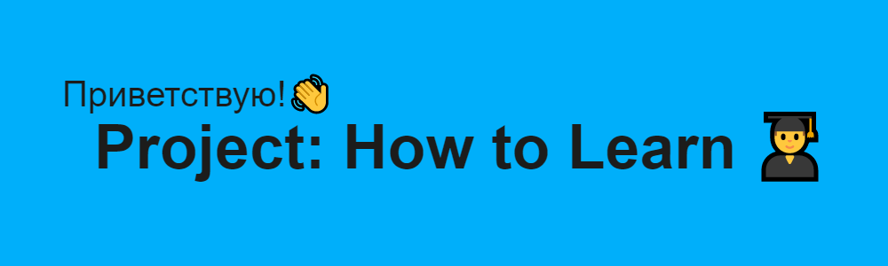

# Научиться учиться

## О проекте
Перед вами одностраничный сайт, выполненный в рамках обучения в Яндексе Практикуме
по программе Веб-разработчик.
Проект создавался в течение первого курса обучения: сентябрь-октябрь 2022 года.

Сайт посвещен теме обучения обучению. В качестве информации представлены подходы к техникам обучения:

* Барбары Оакли;
* Джоша Кауфмана;
* Тима Урбана;
* Нобелевского лауреата Ричарда Фейнмана.

Приведены цифры и факты про учёбу и мозг. Также рекомендована тематическая книга.

## Технологии

Проект реализован на основе таких технологий как:

* Языки программирования: HTML, CSS;  
* БЭМ;
* Файловая структура БЭМ (Nested);
* Flex-блоки;
* Встраиваемые фреймы iframe. В данному случае фрейм видеохостинга Youtube; 
* Анимация декоративных элементов и элементов управления.

## Функциональность

* Возможен просмотр встроенного видео с видеохостинга Youtube;
* Навигация по сайту и активные ссылки:
1) На рекомендуемые ресурсы;
2) на Яндекс Практикум и социальные сети образовательной платформы.
